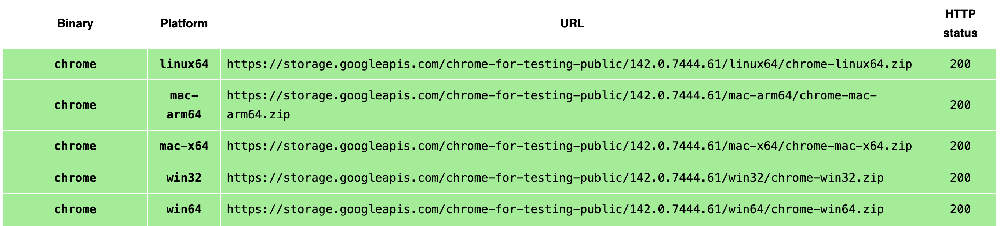

# Job Search Agent

> **Auto‑parse LinkedIn job searches, LLM‑filter what fits you, and get a tidy CSV in your inbox.**


## ✨ Highlights

* **One‑click run**: open Chrome, set your filters once, press Enter – the tool learns your search URL.
* **Smart triage**: two LLM passes — (1) pre-screen the entire job search result, (2) deep‑scan full JDs for must‑have gates.
* **Human‑like browsing**: scrolls realistically to load all results.
* **CSV + Email**: writes timestamped CSV under `./results/` and emails it to you automatically.
* **Blocklist + Seen**: skip companies you dislike and don’t reread the same job twice.


<br>


## 📦 What this repo contains

```bash
.
├─ main.py                 # entrypoint – scraping + LLM filtering + CSV + email
├─ .env                    # OpenAI key, email settings, paths (you need to set up)
├─ requirements.txt        # Python dependencies
├─ results/                # output CSVs (auto‑created)
├─ misc/                   # place Chrome for Testing app folder here (required)
└─ config/                 # configuration files
   ├─ blocklist.txt        # blocklist employer names (you may add more)
   ├─ config.yaml          # your preferences & target roles (you need to set up)
   └─ parsed_job_ids.txt   # jobids from the previous run
```

> ⚠️ The Chrome for Testing **application folder must be inside `misc/`** exactly.


<br>


## 🚀 Quickstart

### 1) Prerequisites

* **Python** 3.10+ (recommended)

* **Chrome for Testing** (CfT)
    * Download CfT for your OS (Arm64/Intel as appropriate) **[here](https://googlechromelabs.github.io/chrome-for-testing/)**
    * Select the build that matches your machine
<p align="center">

</p>

* Unzip and move the **entire application folder** into this repo at **./misc/** exactly.

    ```bash
    misc/
    └─ chrome-mac-arm64/          
    └─ Google Chrome for Testing.app/...
    ```

    > ⚠️ If the app folder is not **exactly** under `misc/`, the program will not run.

* A **LinkedIn** account (you’ll log in once in the automated browser)

* An **OpenAI API key** 

* A **Gmail App Password** (to email yourself the result) — requires 2FA enabled on your Google account
    * See instructions **[here](https://itsupport.umd.edu/itsupport?id=kb_article_view&sysparm_article=KB0015112)**


### 2) Install dependencies

Create and activate a virtual env, then install.

```bash
python -m venv .venv
source .venv/bin/activate
pip install -r requirements.txt
```


### 3) Configure `.env`

Paste in the `OpenAI API Key` and `Gmail App Password`. Set up the `Sender Email` and `Recipient Email`. The `.env` file is located in the project root.

```dotenv
# --- OpenAI ---
OPENAI_API_KEY=sk-...

# --- Email ---
SENDER_EMAIL="you@gmail.com"
RECIPIENT_EMAIL="you@gmail.com"                
GMAIL_APP_PASSWORD="abcdefghijklmnop"     # 16-char app password
```

> ⚠️ You only need to get App Password for the Sender Email. You can also set the Recipietn Email to be the same as the Sender Email.


### 4) Configure `config.yaml`

Minimal example (tweak freely):

```yaml
Preferences:
  - Full-time only
  - Hybrid or Remote preferred
  - Visa sponsorship required
  - Max 4 years required experience (can offset with grad degree)

TargetRoles:
  - Data Scientist
  - Machine Learning Engineer
  - Applied Scientist
```


### 5) Run it

```bash
python main.py
```

* A Chrome window opens. If it’s your **first run**:
  1. Log in to LinkedIn.
  2. Search your role and set filters (location, date posted, seniority, etc.).
  3. *Verify the results look right*, then return to the terminal and press **Enter**.
  4. The exact search URL is auto‑saved to `.env` for next time.
* The script scrolls the results, parses job cards, deep‑reads each JD, writes a CSV in `./results/`, and emails it to you.


<br>


## 🧭 Roadmap (ideas)

* Retry & backoff for flaky page loads
* Optional headless mode
* Multi‑keyword search rotation
* And more...


<br>


## 🙌 Acknowledgments

* Selenium / undetected‑chromedriver community
* OpenAI responses & JSON‑schema validation
